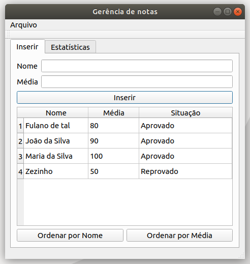
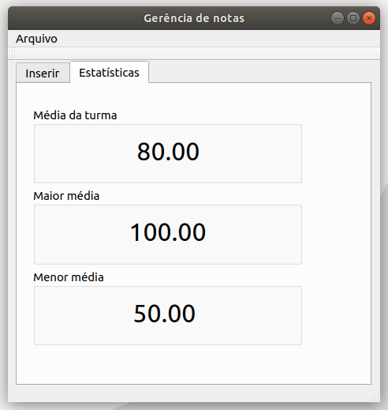
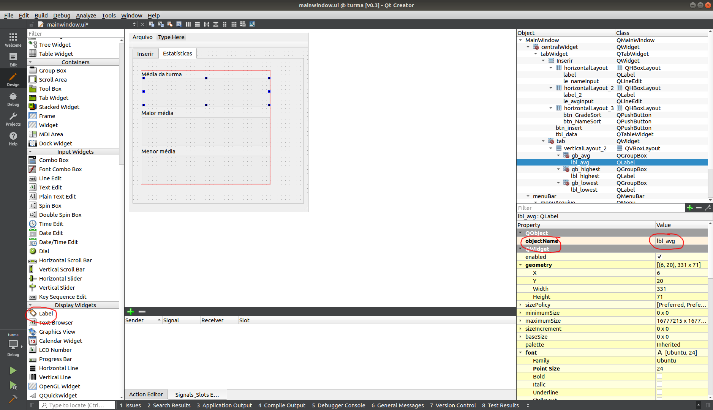

# Gerenciador de alunos 2018.2 
### Código exemplo da aplicação desenvolvida em [QT](www.qt.io) para gerenciar as notas de uma turma

A aplicação deve permitir que o usuário insira vários alunos mostrando os alunos em uma tabela com a possibilidade de ordenação por nomes e nota. A Figura abaixo mostra a tela inicial da aplicação.

O gerenciador de alunos também conta com uma aba para mostrar as estatísticas do turma.

# Os principais componentes (widgets)

## Labels

Os labels estão por toda a aplicação e são os "textos" fixos da aplicação que mostram algum tipo de informação mas o usuário não pode modificar diretamente. 

As labels são importantes pois passam informações sobre outros *widgets* ao usuário. Apesar de serem fixas para o usuário as Labels podem ter o seu texto alterado via código.

### Labels no QT Creator 

Para inserir labels no QT Creator basta estar no modo de edição da interface gráfica (basta dar um duplo clique no arquivo mainwindow.ui) procurar no lado esquerdo da tela pelos *Display Widgets* e a label será o primeiro elemento, basta então clicar e arrastar a label para a posição que você desejar na sua interface. No lado direito da tela você vai encontrar as propriedades da sua label, como o texto que ela vai exibir, o tipo de fonte usada, o tamanho da fonte e uma infinidade de outras opções. Lembre-se de sempre mudar o *objectName* do seu widget para que você possa manipular ela no código. A Figura abaixo ilustra a tela do QT Creator e onde encontrar a label e mudar o seu *objectName*.

Se você criar uma label como o *objectName* de `lbl_media` por exemplo, dentro do código C++ você pode mudar o texto que ela exibe com o seguinte comando `ui->lbl_media->setText("Oi mundo");` 

### Dica

Digamos que você tenha uma váriavel `float media = 85` e deseja exibir ela através de uma label você tem que lembrar de primeiro converter ela para uma `QString` antes de passar para a sua label. Para fazer isso o QT disponibiliza dentro da classe `QString` um método estático chamado `number`para fazer conversão de números para texto. [link para documentação do QT](http://doc.qt.io/qt-5/qstring.html#number-6).

Então usando o método estático `number` da classe `QString` podemos mostrar a váriavel `media` na nossa label da seguinte forma `ui->lbl_media->setText(QString::number(media));` 

## Line Edits

Os *Line edits* são os campos editáveis de um formulário e funcionam como uma das formas de obter algum tipo de informação do usuário. Como o próprio nome diz eles só comportam um linha de texto.

Os *Line edits* ficam dentro dos *Input Widgets* no QT Creator e da mesma forma que os labels basta clicar e arrastar para a posição que você desejar dentro do seu *form*. Como qualquer outro *widget* é sempre importante mudar o *objectName* para um nome que você possa facilmente referenciar dentro do seu código.

Caso você tenha criado o um *line edit* com o nome de `le_nome`, no código para acessar o conteúdo dentro que houver dentro do *line edit* basta utilizar o comando `ui->le_nome->text()`.

### Dica

Os *line edits* podem ser utilizados para obter os mais variados tipos de informações dos usuários, como nomes, idades, endereços, datas, preços, unidades e muitos outros. Por isso os *line edits* sempre consideram que o seu conteúdo é uma *QString* deixando a cargo do desenvolvedor fazer qualquer tipo de conversão de dados, felizmente dentro do QT converter uma *QString* para outros tipos de dados é bem fácil, já que a própria classe possui uma série de métodos que fazem conversão entre tipos. [Link para a documentação do QT](http://doc.qt.io/qt-5/qstring.html#toDouble). Então se você tiver um *line edit* e quiser salvar o seu conteúdo em outro tipo de váriavel que não seja uma *QString* basta fazer como algum dos exemplos abaixo:

+ `QString nome = ui->le_nome->text();` (*QString* => *QString*)
+ `int idade = ui->le_idade->text().toInt();` (*QString* => *int*)
+ `float media = ui->le_media->text().toFloat();` (*QString* => *float*)
+ `std::string rua = ui->le_endereco->text().toStdString();` (*QString* => *string* padrão do C++)
+ `QString titulo = ui->le_titulo->text().toLower();` (*QString* => *QString* minúscula)

## Push Buttons

